# Suspended Beam Drone with Dryden Wind
The suspended beam drone is a uniform rod suspended at the center axis of rotation - equiped with two motors for propulsion.

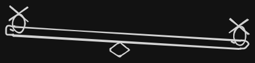

_Don't mind my sketch._

## Features
The features in this simulation project are simply the methods, simulations and questions that were answerd.
1. Basic drone model, pid calculation and control loop setup -> [model_and_pid.ipynb](notebooks/model_and_pid.ipynb)
2. Ziegler-Nichols closed loop pid tunning technique to find the optimal pid constants -> [ziegler_nichols_pid_tunner.ipynb](notebooks/ziegler_nichols_pid_tunner.ipynb)
3. Model recovery from a harsh angular disturbance using the optimal pid parameter from the `ziegler-nichols` tunning method -> [single_disturbance_with_pd_optimal_gain.ipynb](notebooks/single_disturbance_with_pd_optimal_gain.ipynb)
4. Stochastic wind generation using the dryden wind model to simulate the response of the drone model in usch turbulence -> [dryden_wind.ipynb](notebooks/dryden_wind.ipynb)
5. Comparison of all pid parameters from the [ziegler-nichols](ziegler_nichols_pid_constants.json) constants in wind and no wind condtions [pid_parameter_sweep_disturbance_sim.ipynb](notebooks/pid_parameter_sweep_disturbance_sim.ipynb)
6. Simulation configurations - realistic drone model, atmosphere and dryden wind configuration [config.json](config.json)

## Simulation Overview

The goal of the simulation is to model a beam drone with two motor as a source of propulsion located at the very end of the two sides of the drone, the beam is pivoted at its center axis of rotation. 

Making the length from the center to the propulsion equal on both sides.

Hence, the moment of inertia of a uniform rod;

$$I  = 1/12ML^2$$

### Model and PID ops
For the very first operation I model a fairly realistic beam drone model - as I tought it was. In the ops I defined the basic physical constraint of the model, trhe simulation configuration and defined the simulation loop at $$dt = 0.01$$
while setting the pid constants all to zero $$kp,ki,kd = 0,0,0$$

and plotted the graph otput from the loop. 

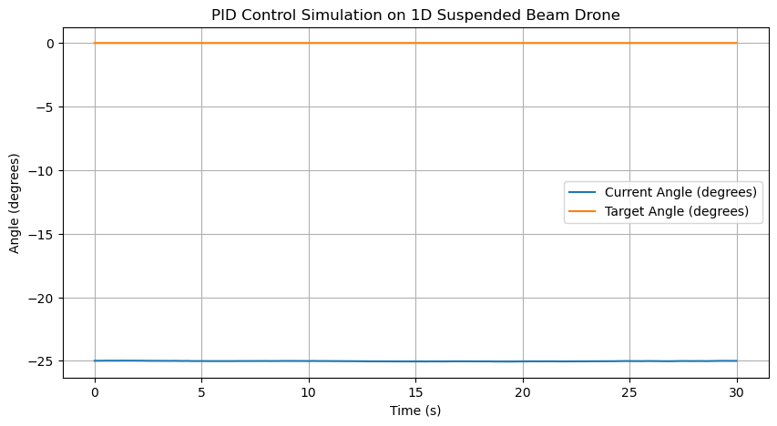

The system can not approach its target at all in this configuration since the pid constants are not set at all.
Explore the notebook for this ops -> [model_and_pid](notebooks/model_and_pid.ipynb)


### Ziegler-Nichols PID Tunning
Since the right PID constants are needed to drive the systems to the right and correct target or setpoint - plant systems. They need to be selected for the optimal and best performance.

One method is to use the `Ziegler-Nichols` closed loop technique to get the optimal pid variables. 

The first step is to set the $$ki, kd = 0,0$$
while increasing the kp as $$kp=0.1^+$$

Until the system achieves stable and sustained oscilation, then the kp can be considerd as the ultimate gain.

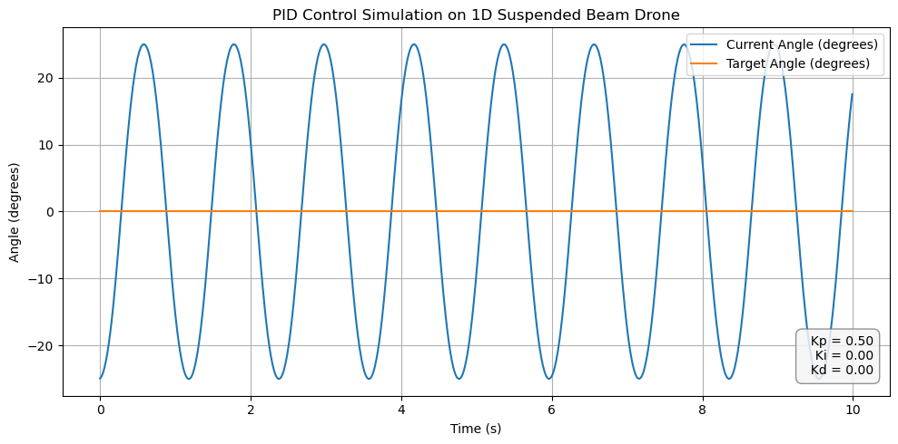

This specific plot shows the system acheieving stable and sustained oscilation at the $$kp=ku=0.50$$

Well, problem is that the specific drone model used in the notebook of this tunnuing is kinda biased. Like almost any kp in this system achieved stable oscilation - which hints at a ver big problem, well I didn't know that was a problem until later. 

Anyways using the formula and techniques I gained from a certain youtube video I was able to calculate the different possible pid constants from the ultimate gain. Thats after I used scipy to detect peaks and stable oscilation then calculate the ultimate period.

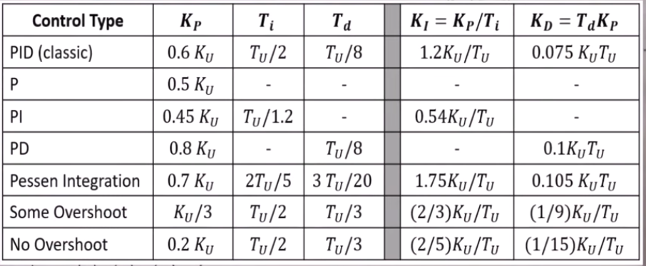
Tunning Table from Christopher Lum - https://www.youtube.com/watch?v=n829SwSUZ_c

With the rules I was able to get the pid constants in this file -> [ziegler_nichols_pid_constants](ziegler_nichols_pid_constants.json) and plot the response graphs you can find all the plots in the folder here -> [ziegler_nichols_tunned_pid](plots/ziegler_nichols_tunned_pid)

Here are the most interesting graphs;

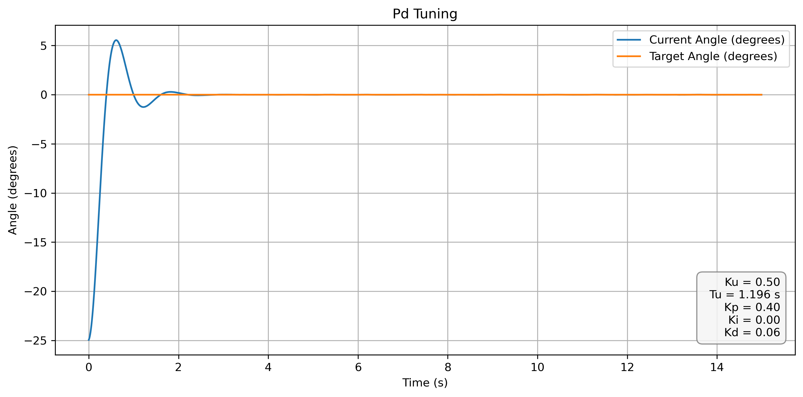

PD stabilised itself at target in about 2 seconds. which is awesome and I assume that to be the best, I even add high hopes for the pid constants for pd.

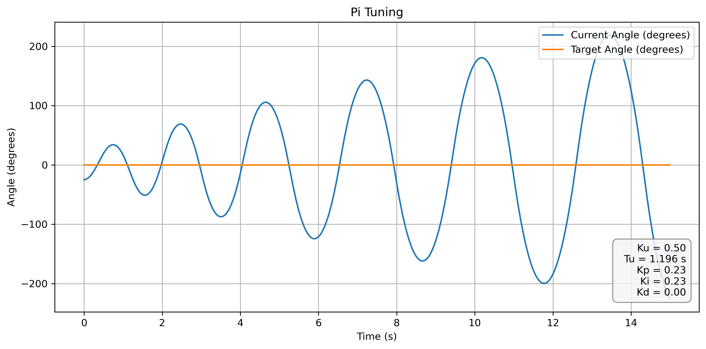

The variables for PI is crazy I mean it just probably increase to infinity, I don't know why am showing it here, but it turns out to be a demonic setup in the future.

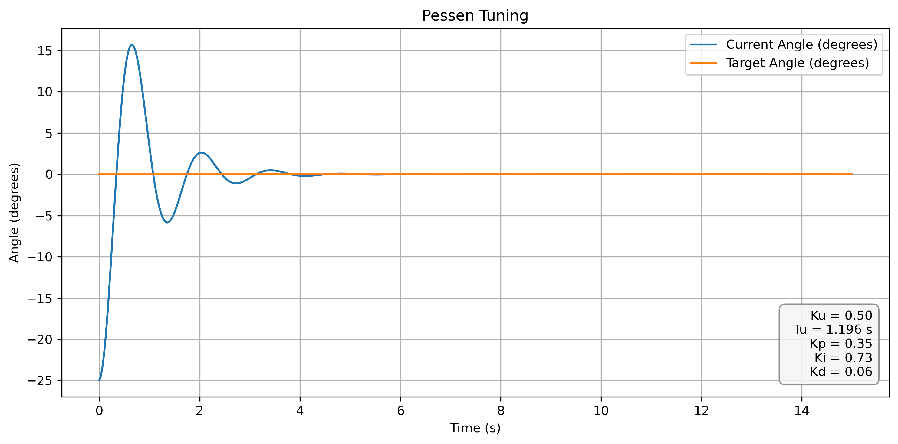
I didn't even knew what pessen means, and I have no reasons to pay attention cause the system settled later at 4s+ - which I naturally don't like.

Explore the notebook here -> [ziegler_nichols_pid_tunner](notebooks/ziegler_nichols_pid_tunner.ipynb)


## Disturbance Rejection with PD Constant

As I have high hopes with the PD constants, I implemented a normal configuration where the drone as to approach and settle at a target setpoint which is 0 degrees from a -25 degrees angle. This is the same flow I used in other phases of the simulation. But in this case it comes with a twist.

I added an abrupt inteference to the current angle of the drone at a certain timepoint. The goal is to see how the drone with its current pd configuration rejects and handles sudden disturbance and continue to settle at its original target.

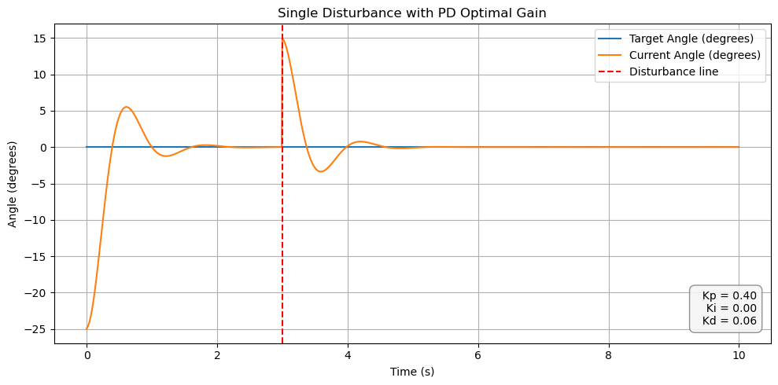

In the plot above a disturbance was introduced at 3 seconds and changed the angle of an already settled system from 0 deg to 15 deg. In about 4.5 seconds it settles back at the target.

This gave me some really good confidence that the system is perfect - only if I had knew all along.

Well, the system reacted and rejected the disturbance very well. The trajectory is very similar to that of the path to approaching the target from the initial point - just a different scale.

Explore the notebook here -> [Disturbance Rejection with PD](notebooks/single_disturbance_with_pd_optimal_gain.ipynb), although nothing fancy just a simple block of code 

```python
    # This block is inside the control loop
    if current_time == 3.0:
        current_angle = 15.0
```


## Dryden Wind
Now its time to model a realistic stochastic wind and test how the drone stabilised manages itself in such turbulence.

This is where the real work is and where things start to actually breakdown. In the real world, wind is kinda crazy like really crazy. Wind can come from any direction within a 3d space, up, down, left, right, etc or anywhere, and a physical drone has to or will naturally react to the drag.

There are a lot of ways to do it, so much I can't type them all in this doc. But I choose to generate wind for two channels and apply them on each arm of the drone. You know how thats not the best idea. Why cause I could not possibly model all the physical reality for example.

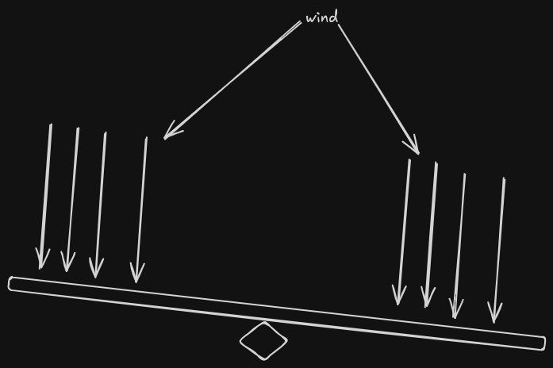

In my model the wind is fixed on each arm acting on there surface area and is used to calculate the wind torque - I mean the tortal torque caused by the wind force - speed.

But!!!

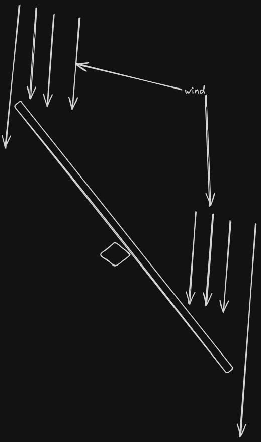

In reality the wind doesn't act on all the surface area at least since the beam as a fixed surface area. Considering the beam can tilt out of angle and the wind will just escape and not all the wind will hit the surface area.

I guess that should be a simple fix, maybe. But I just left it.

In conclusion the wind simulation is not perfect but at least it shows something. The model can react to some sort of turbulence.

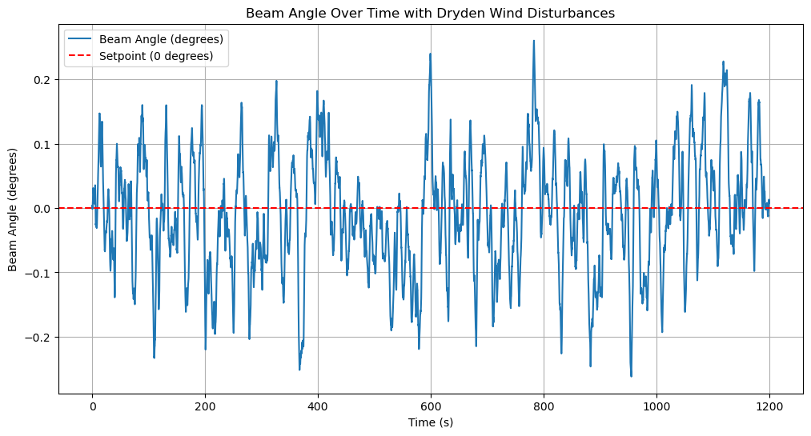

Giving the drone model I have been using and a seed variable of 42 for the dryden wind genration. It looks promising that the drone is able to maintain a stable able of +-0.2 in the distrubance over 1o minutes of simulation.
With the metrics below;

| Metric | Value |
| :--- | :--- |
| **RMSE** | 0.0908 |
| **Max Deflection** | 0.2620 |
| **Std Deviation** | 0.0904 |

This is done while using the PD constants from the ziegler-nichols closed loop tunning. 

At this point everything seemes great, the model works fine, adjusted well in turbulence. GOOD

Explore the notebook here -> [dryden_wind](notebooks/dryden_wind.ipynb)